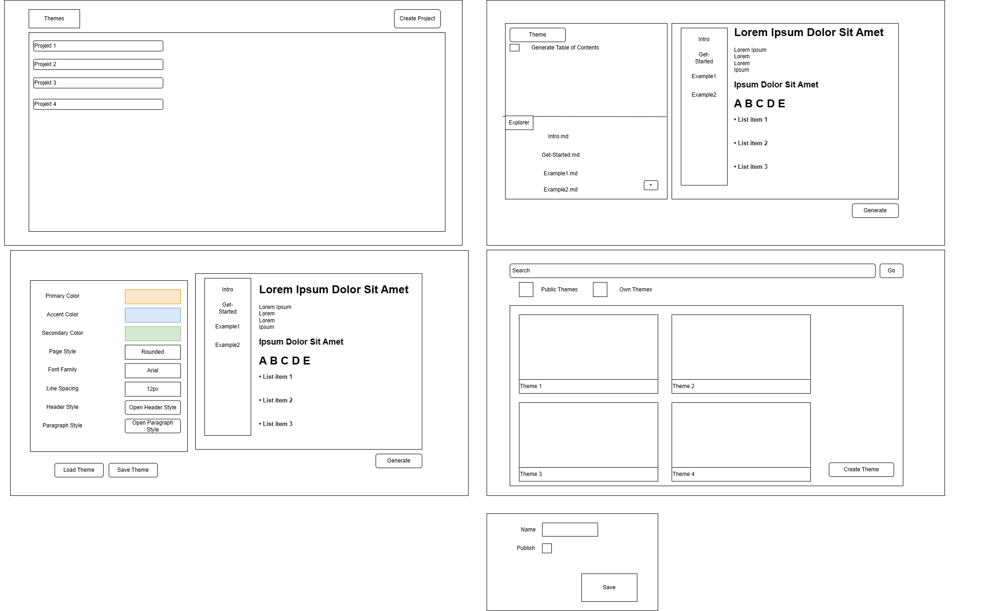

# Pflichtenheft

## Beschreibung der Ausgangslage

* HTL Leonding
* Klasse: 3BHIF
* 3 Projektmitglieder

Es wird ein Projekt die Fächer "Systemplanung und Projektentwiklung" und "Webprogrammieren und Mobilecomputing" benötigt.

## Ist-Zustand

Wenn man schnell eine simple und schöne Website mit Documentation oder Code Highlighting machen will, dann muss man HTML
benutzten und mit CSS mühsam die Fonts und Colors verändern und Code Highlighting mit komischer Syntax implementieren.

## Zielsetzung

### Meilensteine

Zu finden in [Meilensteine](../Meilensteine.md)

## Soll-Zustand

Es gibt eine Website welche Markdown Files in eine statische Website konvertieren kann. Hierbei ist es möglich Designs auszuwählen und zu erstellen. Diese Designs können mit anderen Benutzern geteilt werden. Die statische Website kann als Projekt des Users auf unserer Website gespeichert werden. Für die statische Website kann automatisch eine Inhaltsangabe generieren.

* Projekte
  * erstellbar
  * löschbar
  * veränderbar  
* Übersicht in Projekten
  * Es können mehrere Markdown Files hochgeladen werden
  * Prieview für das ausgewählte File
  * Es kann ein Markdown File zur Startseite gemacht werden
  * Ein Inhaltsverzeichnis kann für jede der Seiten generiert werden
  * Es kann ein Theme ausgewählt werden, von welchem die Daten geladen werden
    * Dies ermöglicht die Bearbeitung von Themes anderer Nutzer
* Themes
  * erstellbar
  * löschbar
  * teilbar mit anderen Benutzern
  * bearbeitbar
  * Themes anderer Benutzer können nachträglich für sich bearbeitet werden
  * durch das löschen geteilter Themes werden sie für andere Benutzer auch gelöscht

Für alle genannten Funktionen wird ein Account benötigt.

### MockUp

### Verwendete Technologien
* Frontend
  * HTML
  * CSS
  * Typescript
* Backend
  * Typescript
  * Express
  * NodeJS

## Mengengerüst

Da es ein Schulprojekt ist, wird mit allerhöchstens 100 Aufrufen in der Stunde gerechnet.