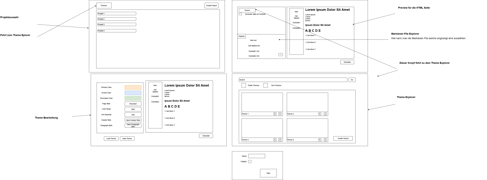

# Pflichtenheft

## Beschreibung der Ausgangslage

* HTL Leonding
* Klasse: 3BHIF
* 3 Projektmitglieder

Es wird ein Projekt die Fächer "Systemplanung und Projektentwiklung" und "Webprogrammieren und Mobilecomputing" benötigt.

## Ist-Zustand

Es ist mühsam und langsam eine Webseite mit HTML zu machen und mit CSS zu stylen. Codehighlighting ist schwierig richtig umzusetzen. Das schreiben einer Dokumentation in HTML ist unangenehm.

## Zielsetzung

### Meilensteine

Zu finden in [Meilensteine](../Meilensteine.md)

## Soll-Zustand

Du kannst Dokumentation normal mit Markdown schreiben und dann einfach in HTML konvertieren lassen. Der Style der Webseite kann einfach verändert werden. Es muss nicht immer jedes Theme selbst gemacht werden, da man schon vorhandene eigene und Themes von anderen einfach anwenden kann. Codehighlighting wird automatisch konvertiert und man muss sich keine weiteren Gedanken darüber machen.

### MockUp

### Verwendete Technologien
* Frontend
  * HTML
  * CSS
  * Typescript
* Backend
  * Typescript
  * Express
  * NodeJS

## Mengengerüst

Da es ein Schulprojekt ist, wird mit allerhöchstens 100 Aufrufen in der Stunde gerechnet.